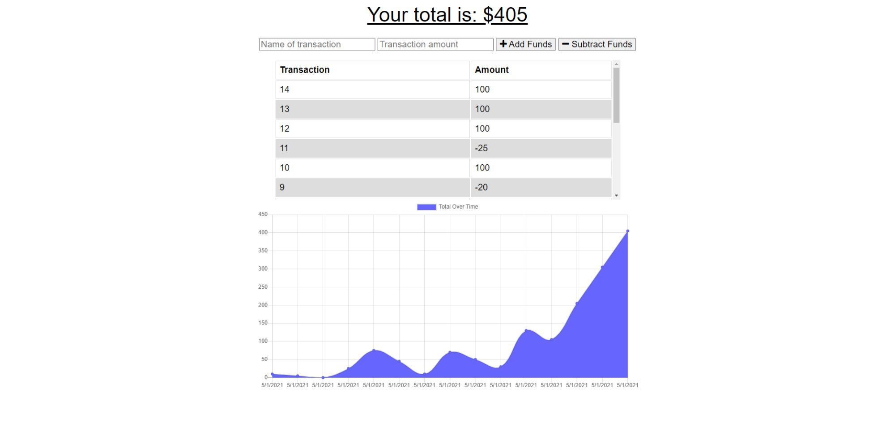

# Budget Buddy

## Description

This repo contains a nodejs, express server, and mongoDB based budgeting application. Users can reliably perform simple budgeting operations with or without internet connectivity. If calculations are made with a spotty or even no internet connection at all, data will be saved locally until connection is reestablished.

## Table of Contents

* [Installation](#installation)

* [Usage](#usage)

* [Credits](#credits)

* [License](#license)

 

* Displays a list of user generated budgeting transactions
* Allows for adding income
* Allows for subracting expeditures
* Displays a graph as a visual representation of transactions

 

This budgeting app is intended to provide a minimalistic approach to dealing with everday financial management with a nice visual graph for easy comprehension.

 

[Budget Buddy](https://bude7-13uddy.herokuapp.com/)

***

## Installation

To run Budget Buddy, either follow the link above or you can copy/clone/fork this repository. Make sure to install the express, mongoose, morgan and compression libraries. "npm init" to intialiaze the package manager followed by "npm install {dependency}". This will setup the necessary packages required.

***

## Usage

This application is used to create a timeline of budgeting transactions. The minimalist interface is ideal for a quick workflow and "easy on the eyes" visual representation. Easily keep track of income and expenditures with this sweet app.

 

***

## Credits

W3Schools for always being there | 
[W3Schools](https://www.w3schools.com/)

 

***

## License

All Rights Reserved.
